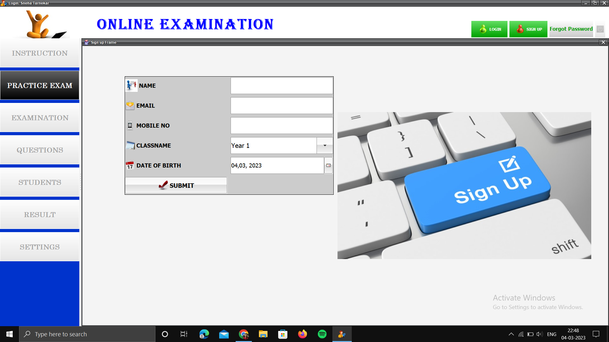
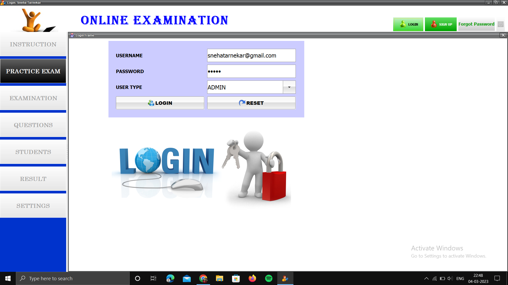
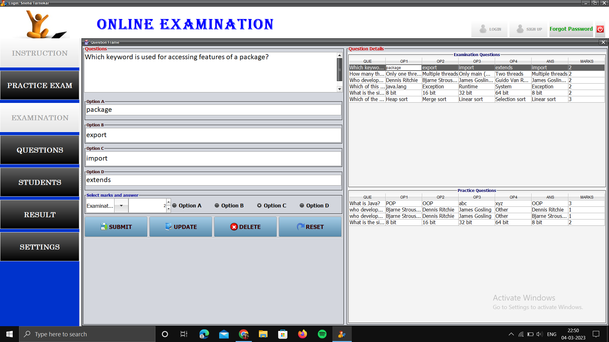
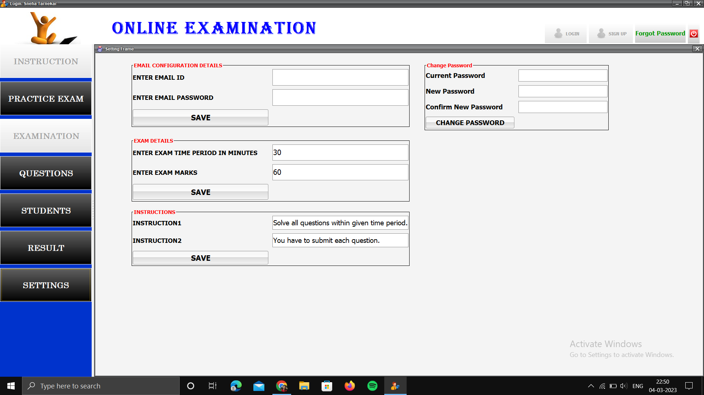
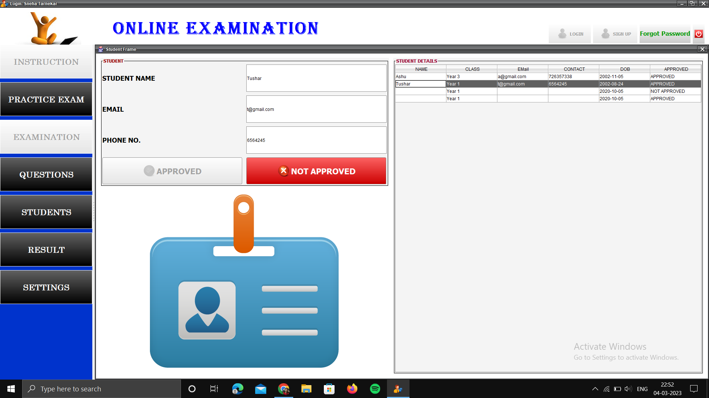
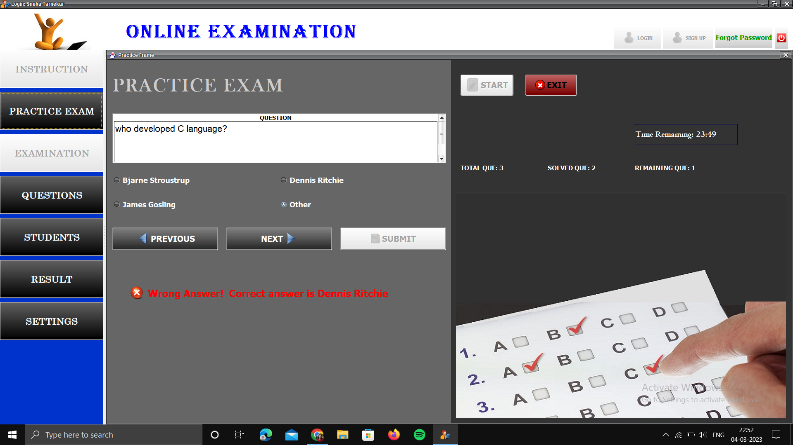
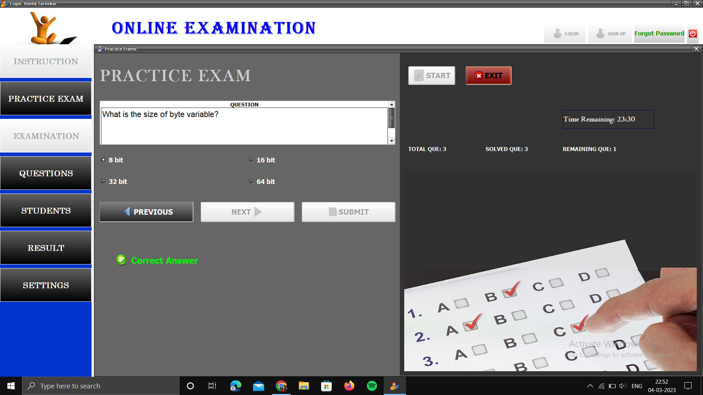

# Online-Examination-System
The project Online Examination System provides facility for students to give an online exam. Administrators to set different examination and question banks for registered students and members. The question bank will form the database of automated process.

# unzip all the files

## Sign up

## Login

## Admin access to set exam questions

## Admin access to set examination instructions, rules and timing

## Admin can approve and refuse a student based on eligibility

## Practice exam tab is open for all even without login
 Student can see the answer and check whether it is correct or not after submitting
 

## Follow me on Socials

  
  
  
  
  

